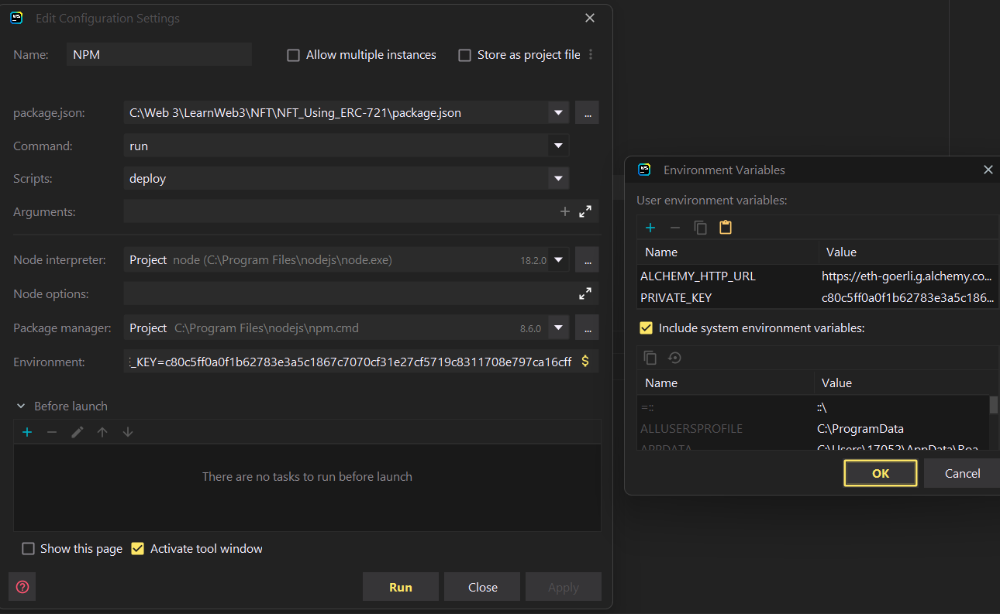

# Sample NFT Project Using ERC-721

Refer below link for more details
https://learnweb3.io/courses/9a3fafe4-b5eb-4329-bdef-97b2aa6aacc1/lessons/017e65bf-2a86-455e-a499-09b61ffa5241


## Webstorm configuration for deploying
1. Add below script in package
2. ```angular2html
    "scripts": {
      "deploy": "hardhat run scripts/deploy.js --network goerli"
    }
    ```
3. Add NPM under configuration in webstorm

4. Fill in environment variable. In code use `process.env.MNEMONIC`
